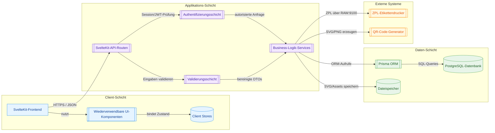

# Etikettdrucker Software-Architektur-Dokument

### Dokumentinformationen

* **Projekt**: Rotoclear Etikettdrucker System
* **Version**: 0.2
* **Zuletzt aktualisiert**: 29. August 2025
* **Architekt**: Jayesh Kakkad
* **Dokumentenstatus**: Beta-Release

---

# Überblick

Diese umfassende Architekturdokumentation liefert detaillierte technische Spezifikationen, Designentscheidungen und Implementierungsrichtlinien für das **Etikettdrucker**-System. Es handelt sich um eine moderne Webanwendung, die mit SvelteKit entwickelt wurde, um Etiketten für Qualitätsprüfprozesse bei Rotoclear zu erzeugen und zu drucken. Das System hat den Status **v1.0.0-beta** erreicht – mit erweiterten Dashboard-Analysen, verbesserter Formularvalidierung, vollständigen Qualitätskontroll-Workflows und interaktiven Datenvisualisierungen.

## Struktur des Architekturdokuments

### Teil 1: Systemüberblick & Geschäftskontext

* **Geschäftliche Anforderungen**: Etikettendruck für Qualitätskontrolle in den Rotoclear-Abläufen
* **Systemarchitektur**: Stack-Überblick SvelteKit + PostgreSQL + Prisma
* **Stakeholder**: Endanwender, Administratoren, Systemintegratoren
* **Use Cases**: Etikettierungs-Workflows für verschiedene Produkttypen
* **Systembeschränkungen**: Windows-Server-Deployment, Anforderungen an Druckerintegration

### Teil 2: Technische Architektur & Komponentendesign

* **Frontend-Architektur**: Aufbau der SvelteKit-App und Komponentendesign
* **Backend-Architektur**: API-Design, Service-Layer-Patterns und Request-Handling
* **Komponentenorganisation**: Wiederverwendbare UI-Komponenten und Utility-Funktionen
* **State-Management**: Svelte Stores und Datenflussmuster
* **Routing-Strategie**: Dateibasiertes Routing und Authentifizierungs-Middleware

### Teil 3: Datenarchitektur & Datenbankdesign

* **Datenbankdesign**: PostgreSQL-Schema mit Prisma ORM
* **Datenmodelle**: Benutzerverwaltung, Druckaufträge, Systemkonfiguration
* **Beziehungen**: Entitätsbeziehungen und Datenintegritäts-Constraints
* **Migrationsstrategie**: DB-Versionierung und Bereitstellungsverfahren
* **Datenfluss**: Verarbeitung und Speicherung von Anwendungsdaten

### Teil 4: Sicherheitsarchitektur & Implementierung

* **Authentifizierungssystem**: Sitzungsbasierte Authentifizierung mit sicherem Passwort-Handling
* **Autorisierungsmodell**: Rollenbasierte Zugriffskontrolle (RBAC)
* **Datenschutz**: Verschlüsselung, Eingabevalidierung und XSS-Prävention
* **Security Best Practices**: HTTPS, CSP-Header, Schwachstellen-Mitigation
* **Audit-Logging**: Nachverfolgung und Monitoring von Sicherheitsereignissen

### Teil 5: Deployment-Architektur & DevOps-Strategie

* **Infrastruktur-Anforderungen**: Spezifikationen für Windows-Server-Deployment
* **Build-Pipeline**: Automatisierte Build- und Deployment-Prozesse
* **Umgebungskonfiguration**: Setups für Entwicklung, Staging und Produktion
* **Monitoring & Wartung**: Health-Checks, Logging, Backup-Strategien
* **Performance-Optimierung**: Caching, DB-Tuning, Skalierbarkeit

### Teil 6: Entwicklungsstandards & Richtlinien

* **Codestandards**: Konventionen für TypeScript, Svelte und Datenbank
* **Teststrategie**: Unit-, Integrations- und End-to-End-Tests
* **Performance-Guidelines**: Optimierung für Frontend & Backend
* **Qualitätssicherung**: ESLint, Prettier, automatisierte Checks
* **Dokustandards**: Code-Doku und API-Spezifikationen

## Quick-Start-Leitfaden

### Für Entwickler\:innen

1. **System Overview** für den Geschäftskontext lesen
2. **Technical Architecture** für das Komponentenverständnis prüfen
3. **Development Standards** für Coding-Richtlinien studieren
4. **Data Architecture** für Datenbankmuster befolgen

### Für Systemadministratoren

1. Mit **System Overview** starten (Anforderungen)
2. **Deployment Architecture** für Infrastruktur im Fokus
3. **Security Architecture** für Sicherheitskonfiguration prüfen
4. Verfahren zu Monitoring & Wartung studieren

### Für Architekt\:innen

1. Alle Teile der Reihe nach lesen (Gesamtverständnis)
2. Besonderes Augenmerk auf Designentscheidungen und Begründungen
3. Fokus auf Skalierbarkeit und Erweiterbarkeit
4. Integrationspunkte und externe Abhängigkeiten verstehen

## Technologiestack

### Frontend

* **Framework**: SvelteKit 2.0+
* **Sprache**: TypeScript
* **Styling**: CSS mit Custom Properties
* **Build-Tool**: Vite
* **Tests**: Vitest + Playwright

### Backend

* **Runtime**: Node.js 18+
* **Datenbank**: PostgreSQL 14+
* **ORM**: Prisma
* **Authentifizierung**: Sitzungsbasiert mit sicheren Cookies
* **Validierung**: Zod-Schema-Validierung

### Infrastruktur

* **Plattform**: Windows Server 2019+
* **Webserver**: IIS mit Node.js-Integration
* **Prozessmanager**: PM2 oder Windows-Dienst
* **Reverse Proxy**: IIS mit URL Rewrite
* **SSL/TLS**: Windows-Zertifikatsspeicher

## Zentrale Funktionen

### Kernfunktionalität

* **Multi-Label-Support**: Etikettentypen C2, CPRO, CBASIC und KK
* **Qualitätskontroll-Integration**: Prüfer-A- und Prüfer-B-Workflows mit fortgeschrittener Änderungsdetektion
* **Druckverwaltung**: ZPL-Code-Erzeugung und Druckerkommunikation
* **Benutzerverwaltung**: Rollenbasierte Zugriffskontrolle mit Unternehmens-Trennung
* **Interaktives Dashboard**: Monatliche Produktionsanalysen mit Hover-Tooltips und visuellen Insights
* **QR-Code-Erzeugung**: Dynamische QR-Codes für Produktnachverfolgbarkeit
* **PDF-Export**: Professionelle Zertifikats- und Report-Generierung

### Technische Features

* **Responsives Design**: Mobilfreundliche Oberfläche für den Shopfloor
* **Echtzeit-Updates**: Live-Status für Druckaufträge und Qualitätskontrolle
* **Erweiterte Formularvalidierung**: Umfassender Vergleich zwischen Prüferdaten
* **Interaktive Charts**: Professionelle Visualisierung mit Chart.js
* **Fehlerbehandlung**: Umfassendes Error-Logging und Nutzerfeedback
* **Performance**: Optimiert für hochfrequenten Etikettendruck und Datenverarbeitung

### Dashboard-Analysen (v1.0.0-beta)

* **Monatliche Produktionsdiagramme**: Interaktive Balkendiagramme mit Hover-Tooltips
* **Produktionsstatistiken**: Echtzeit-Produktionsmetriken und KPIs
* **Mobil optimiert**: Vollständig für Mobil- und Tablet-Ansicht optimiert
* **Professionelles Styling**: Aufgeräumtes, modernes Interface mit besserer UX

### Sicherheitsfunktionen

* **Authentifizierung**: Sicheres Login mit Passwortrichtlinien
* **Autorisierung**: Rollenbasierte Berechtigungen (Admin, Manager, User, ReadOnly)
* **Datenschutz**: Verschlüsselte sensible Daten und sichere Sessions
* **Audit-Trail**: Lückenlose Protokollierung von Benutzeraktionen und Systemereignissen

## Architekturprinzipien

### Design-Prinzipien

1. **Modularität**: Klare Trennung der Verantwortlichkeiten, wiederverwendbare Komponenten
2. **Skalierbarkeit**: Ausgelegt für wachsende Last und Nutzerzahlen
3. **Wartbarkeit**: Sauberer Code mit umfassender Dokumentation
4. **Sicherheit**: Security-First-Design mit Defense-in-Depth
5. **Performance**: Optimiert für reaktionsschnelle Benutzererfahrung

### Technische Entscheidungen

1. **SvelteKit-Wahl**: Modernes Framework mit hervorragender Performance und DX
2. **PostgreSQL**: Robustes RDBMS mit starker JSON-Unterstützung
3. **Prisma ORM**: Typsicherer Datenzugriff mit automatisierten Migrationen
4. **Session-Auth**: Einfache, sichere Authentifizierung für den internen Einsatz
5. **Windows-Deployment**: Integration in bestehende Rotoclear-Infrastruktur

## Systemgrenzen & Beschränkungen

### 4.1 Systemgrenzen

#### In Scope

* Qualitätsprüf-Workflows für alle Produktlinien
* Etikettendruck und QR-Code-Erzeugung
* Benutzer-Authentifizierung und -Autorisierung
* Außenkarton-Zusammenstellung mit Komponenten-Tracking
* Basis-Reporting und Dashboard-Funktionalität

#### Out of Scope

* Integration in Bestandsverwaltung
* Erweiterte Analytik und Business Intelligence
* Integration in Drittsysteme (ERP)
* Mobile App Entwicklung (Phase 1)

### 4.2 Technische Beschränkungen

#### Infrastruktur

* **Windows-Umgebung**: Primäres Deployment auf Windows Server
* **Netzwerkgrenzen**: Zunächst auf lokales Netzwerk beschränkt
* **Druckerintegration**: Unterstützung vorhandener Zebra-Etikettendrucker erforderlich

#### Entwicklungsbeschränkungen

* **Browser-Support**: Nur moderne Browser (Chrome, Firefox, Edge)
* **Sprachanforderungen**: Deutsche UI mit möglicher englischer Lokalisierung
* **Entwicklungsteam**: Kleines Team → wartbarer, gut dokumentierter Code

### 4.3 Geschäftliche Beschränkungen

#### Compliance

* **Qualitätsstandards**: Unterstützung von ISO-Qualitätsmanagementprozessen
* **Audit-Anforderungen**: Vollständige Nachverfolgbarkeit aller Prüftätigkeiten
* **Datenaufbewahrung**: Mindestens 7 Jahre für qualitätsrelevante Daten

#### Betrieblich

* **Schulung**: Minimaler Schulungsaufwand für bestehendes Personal
* **Migration**: Sanfter Übergang von manuellen Prozessen
* **Downtime**: Begrenzte Wartungsfenster während der Produktionszeiten

---

## 2. Geschäftskontext & Domänenmodell

### 2.1 Unterstützte Produktlinien

#### C-Basic-Produkte

* **Zweck**: Einstiegs-Produktlinie
* **Prüfschritte**: Prüfer A → Prüfer B → QR-Vorschau → Etikettendruck
* **Merkmale**: Vereinfachter Workflow, Basis-Qualitätsprüfungen

#### C2-Produkte

* **Zweck**: Mittelklasse-Produktlinie mit DMG/RC/EDU/DEMO-Konfigurationen
* **Prüfschritte**: Prüfer A → Prüfer B → QR-Vorschau → Etikettendruck
* **Merkmale**: Konfigurationsabhängige Artikelnummern und Spezifikationen

#### C-Pro-Produkte

* **Zweck**: Professionelle Produktlinie mit Speicher-Varianten (256 GB, 1 TB, 4 TB)
* **Prüfschritte**: Prüfer A → Prüfer B → QR-Vorschau → Etikettendruck
* **Merkmale**: Speicherkapazitätsabhängige Spezifikationen und Preise

#### KK-Produkte

* **Zweck**: Spezialisierte Produktlinie
* **Prüfschritte**: Prüfer A → Prüfer B → QR-Vorschau → Etikettendruck
* **Merkmale**: Spezifischer Workflow mit Datei-Uploads

### 2.2 Zentrale Geschäftsprozesse

#### Test-Workflow

#### Qualitätskontroll-Phasen

1. **Prüfer A**: Initiale Komponentenprüfung und Validierung
2. **Prüfer B**: Endprüfung der Montage und Freigabe
3. **Etikettenerzeugung**: QR-Code und Spezifikationen drucken
4. **Verpackung**: Außenkarton-Zusammenstellung mit Komponenten-Tracking

### 2.3 Benutzerrollen & Berechtigungen

#### Administrative Rollen

* **ADMIN**: Vollzugriff, Benutzerverwaltung, Systemkonfiguration
* **MANAGEMENT**: Produktübergreifende Übersicht, Reporting, Benutzeraufsicht

#### Operative Rollen

* **PRUEFER\_AB**: Vollständige Prüfrechte über alle Phasen
* **PRUEFER\_A**: Auf initiale Prüfschritte beschränkt
* **PRUEFER\_B**: Auf Endprüfung/Freigabe beschränkt
* **VIEWER**: Nur-Lesen-Zugriff für Monitoring und Reporting

---

## 3. Architektur-Vision

### 3.1 Architekturelle Prinzipien

#### Modularität

* **Produktspezifische Module**: Eigene Routen/Logik pro Produktlinie
* **Geteilte Komponenten**: Wiederverwendbare UI-Bausteine und Business-Logik
* **Klare Trennung**: Getrennte Verantwortungen für Testen, Drucken, Management

#### Skalierbarkeit

* **Horizontale Skalierung**: Zustandsarme Anwendungsarchitektur
* **Datenbankoptimierung**: Effiziente Queries und Index-Strategien
* **Caching-Strategie**: Sitzungs- und applikationsseitiges Caching

#### Sicherheit

* **Authentifizierung**: JWT-gestütztes Sitzungsmanagement
* **Autorisierung**: Rollenbasierte Zugriffskontrolle
* **Datenschutz**: Verschlüsselte sensible Daten und abgesicherte API-Endpunkte

#### Wartbarkeit

* **TypeScript**: Starke Typisierung in der gesamten Anwendung
* **Komponentenarchitektur**: Wiederverwendbare Svelte-Komponenten
* **Dokumentation**: Umfassende Code- und API-Doku

### 3.2 Begründung des Technologiestacks

#### Frontend: SvelteKit

**Warum gewählt:**

* **Performance**: Compile-Time-Optimierungen, geringer Runtime-Overhead
* **Developer Experience**: Intuitive Syntax, exzellente TypeScript-Unterstützung
* **Full-Stack**: Integriertes SSR und API-Fähigkeiten
* **Bundle-Größe**: Kleinere Produktions-Bundles als React/Vue

#### Backend: SvelteKit + Node.js

**Warum gewählt:**

* **Einheitlicher Stack**: Eine Technologie für Frontend und Backend
* **Type-Safety**: Geteilte Typen zwischen Client und Server
* **Schnelle Entwicklung**: Integriertes Routing und API-Entwicklung

#### Datenbank: PostgreSQL + Prisma

**Warum gewählt:**

* **Zuverlässigkeit**: ACID-Compliance für qualitätskritische Daten
* **Type-Safety**: End-to-end-Typsicherheit durch Prisma
* **Skalierbarkeit**: Robuste Performance unter Last
* **Migrationen**: Versionierte Schema-Evolution

#### Etikettendruck: ZPL (Zebra Programming Language)

**Warum gewählt:**

* **Industriestandard**: Breite Kompatibilität mit Industriedruckern
* **Präzision**: Exakte Positionierung und Formatkontrolle
* **Zuverlässigkeit**: Bewährt in Fertigungsumgebungen

### 3.3 Qualitätsmerkmale

#### Performance-Ziele

* **Page Load Time**: < 2 s für alle primären Workflows
* **DB-Antwortzeit**: < 100 ms für Standardabfragen
* **Etikettenerzeugung**: < 3 s von Abgabe bis Druckbereitschaft

#### Zuverlässigkeitsanforderungen

* **Verfügbarkeit**: 99,5 % während Geschäftszeiten
* **Datenintegrität**: Null Toleranz für Datenverlust bei QC-Records
* **Backup-Strategie**: Tägliche automatische Backups mit Point-in-Time-Recovery

#### Sicherheitsanforderungen

* **Authentifizierung**: Fähigkeit zur Multi-Faktor-Authentifizierung
* **Sitzungsmanagement**: Sichere Token-Handhabung mit angemessener Ablaufzeit
* **Audit-Trail**: Vollständige Protokollierung aller qualitätskritischen Operationen

---
