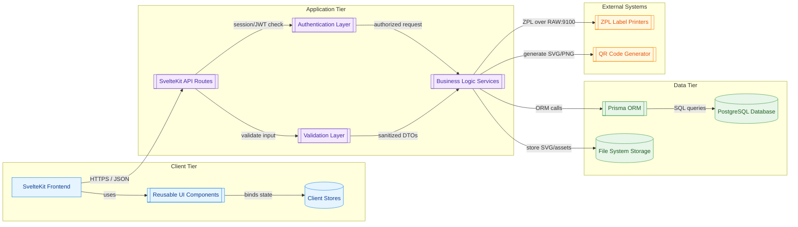

# Etikettdrucker Software Architecture Document

### Document Information
- **Project**: Rotoclear Etikettdrucker System
- **Version**: 0.2
- **Last Updated**: August 29, 2025
- **Architect**: Jayesh Kakkad
- **Document Status**: Beta Release

---

# Overview

This comprehensive architecture documentation provides detailed technical specifications, design decisions, and implementation guidelines for the Etikettdrucker (Label Printer) system. The system is a modern web application built with SvelteKit for generating and printing labels for Rotoclear quality control processes. The system has reached v1.0.0-beta with enhanced dashboard analytics, improved form validation, comprehensive quality control workflows, and interactive data visualization capabilities.

## Architecture Document Structure

### Part 1: System Overview & Business Context
- **Business Requirements**: Quality control label printing for Rotoclear operations
- **System Architecture**: SvelteKit + PostgreSQL + Prisma stack overview
- **Stakeholders**: End users, administrators, system integrators
- **Use Cases**: Label generation workflows for different product types
- **System Constraints**: Windows Server deployment, printer integration requirements

### Part 2: Technical Architecture & Component Design
- **Frontend Architecture**: SvelteKit application structure and component design
- **Backend Architecture**: API design, service layer patterns, and request handling
- **Component Organization**: Reusable UI components and utility functions
- **State Management**: Svelte stores and data flow patterns
- **Routing Strategy**: File-based routing and authentication middleware

### Part 3: Data Architecture & Database Design
- **Database Design**: PostgreSQL schema with Prisma ORM
- **Data Models**: User management, print jobs, and system configuration
- **Relationships**: Entity relationships and data integrity constraints
- **Migration Strategy**: Database versioning and deployment procedures
- **Data Flow**: Application data processing and storage patterns

### Part 4: Security Architecture & Implementation
- **Authentication System**: Session-based authentication with secure password handling
- **Authorization Model**: Role-based access control (RBAC) implementation
- **Data Protection**: Encryption, input validation, and XSS prevention
- **Security Best Practices**: HTTPS, CSP headers, and vulnerability mitigation
- **Audit Logging**: Security event tracking and monitoring

### Part 5: Deployment Architecture & DevOps Strategy
- **Infrastructure Requirements**: Windows Server deployment specifications
- **Build Pipeline**: Automated build and deployment procedures
- **Environment Configuration**: Development, staging, and production setups
- **Monitoring & Maintenance**: Health checks, logging, and backup strategies
- **Performance Optimization**: Caching, database tuning, and scalability considerations

### Part 6: Development Standards & Guidelines
- **Code Standards**: TypeScript, Svelte, and database coding conventions
- **Testing Strategy**: Unit, integration, and end-to-end testing frameworks
- **Performance Guidelines**: Frontend and backend optimization techniques
- **Quality Assurance**: ESLint, Prettier, and automated quality checks
- **Documentation Standards**: Code documentation and API specification guidelines

## Quick Start Guide

### For Developers
1. Read System Overview for business context
2. Review Technical Architecture for component understanding
3. Study Development Standards for coding guidelines
4. Follow Data Architecture for database patterns

### For System Administrators
1. Start with System Overview for requirements
2. Focus on Deployment Architecture for infrastructure
3. Review Security Architecture for security configuration
4. Study monitoring and maintenance procedures

### For Architects
1. Review all parts sequentially for comprehensive understanding
2. Pay special attention to design decisions and rationales
3. Focus on scalability and extensibility considerations
4. Understand integration points and external dependencies

## Technology Stack

### Frontend
- **Framework**: SvelteKit 2.0+
- **Language**: TypeScript
- **Styling**: CSS with custom properties
- **Build Tool**: Vite
- **Testing**: Vitest + Playwright

### Backend
- **Runtime**: Node.js 18+
- **Database**: PostgreSQL 14+
- **ORM**: Prisma
- **Authentication**: Session-based with secure cookies
- **Validation**: Zod schema validation

### Infrastructure
- **Platform**: Windows Server 2019+
- **Web Server**: IIS with Node.js integration
- **Process Manager**: PM2 or Windows Service
- **Reverse Proxy**: IIS with URL Rewrite
- **SSL/TLS**: Windows Certificate Store

## Key Features

### Core Functionality
- **Multi-Label Support**: C2, CPRO, CBASIC, and KK label types
- **Quality Control Integration**: Prüfer A and B workflows with advanced change detection
- **Print Management**: ZPL code generation and printer communication
- **User Management**: Role-based access control with company separation
- **Interactive Dashboard**: Monthly production analytics with hover tooltips and visual insights
- **QR Code Generation**: Dynamic QR codes for product traceability
- **PDF Export**: Professional certificate and report generation

### Technical Features
- **Responsive Design**: Mobile-friendly interface optimized for shop floor use
- **Real-time Updates**: Live status updates for print jobs and quality control
- **Advanced Form Validation**: Comprehensive change detection between inspector data
- **Interactive Charts**: Professional data visualization with Chart.js integration
- **Error Handling**: Comprehensive error logging and user feedback
- **Performance**: Optimized for high-frequency label printing and data processing

### Dashboard Analytics (v1.0.0-beta)
- **Monthly Production Charts**: Interactive bar charts with hover tooltips
- **Production Statistics**: Real-time production metrics and KPIs
- **Mobile Responsive**: Fully optimized for mobile and tablet viewing
- **Professional Styling**: Clean, modern interface with improved UX

### Security Features
- **Authentication**: Secure login with password policies
- **Authorization**: Role-based permissions (Admin, Manager, User, ReadOnly)
- **Data Protection**: Encrypted sensitive data and secure sessions
- **Audit Trail**: Complete logging of user actions and system events

## Architecture Principles

### Design Principles
1. **Modularity**: Clear separation of concerns with reusable components
2. **Scalability**: Designed to handle increasing load and user base
3. **Maintainability**: Clean code with comprehensive documentation
4. **Security**: Security-first design with defense in depth
5. **Performance**: Optimized for responsive user experience

### Technical Decisions
1. **SvelteKit Choice**: Modern framework with excellent performance and developer experience
2. **PostgreSQL Database**: Robust RDBMS with excellent JSON support
3. **Prisma ORM**: Type-safe database access with automated migrations
4. **Session Authentication**: Simple, secure authentication suitable for internal use
5. **Windows Deployment**: Integration with existing Rotoclear infrastructure

## System Requirements

### Production Environment
- **Operating System**: Windows Server 2019 or later
- **Memory**: 16 GB RAM minimum, 32 GB recommended
- **Storage**: 250 GB SSD for application and database
- **Network**: 1 Gbps Ethernet connection
- **Database**: PostgreSQL 14+ with connection pooling

### Development Environment
- **Operating System**: Windows 10/11, macOS, or Linux
- **Node.js**: Version 18 or later
- **Database**: PostgreSQL 14+ (local or containerized)
- **Memory**: 8 GB RAM minimum
- **Storage**: 20 GB available space

## Getting Started

### Development Setup
```bash
# Clone repository
git clone [repository-url]
cd etikettdrucker

# Install dependencies
npm install

# Setup database
npx prisma migrate dev
npx prisma db seed

# Start development server
npm run dev
```

### Production Deployment
```bash
# Build application
npm run build:production

# Deploy to Windows Server
# See Part 5: Deployment Architecture for detailed procedures
```

## Contributing

### Code Contributions
1. Follow Development Standards
2. Write tests for new features
3. Update documentation for architectural changes
4. Follow security guidelines for data handling

### Documentation Updates
1. Keep architecture documentation current with code changes
2. Update this README when adding new sections
3. Ensure examples are tested and functional
4. Maintain consistency in documentation style

## Support and Maintenance

### Regular Maintenance
- **Daily**: Monitor system health and performance
- **Weekly**: Review security logs and update dependencies
- **Monthly**: Database maintenance and backup verification
- **Quarterly**: Security assessment and penetration testing

### Troubleshooting
1. Check Deployment Architecture for common issues
2. Review application logs in the logs directory
3. Verify database connectivity and performance
4. Check printer network connectivity and driver status

## Future Enhancements

### Planned Features
1. **Mobile Application**: Native mobile app for shop floor operators
2. **Advanced Reporting**: Analytics dashboard for print job statistics
3. **Integration APIs**: REST APIs for external system integration
4. **Multi-Language Support**: Internationalization for global deployment

### Technical Improvements
1. **Microservices Architecture**: Decomposition for better scalability
2. **Container Deployment**: Docker containerization for easier deployment
3. **Cloud Integration**: Azure/AWS deployment options
4. **Real-time Synchronization**: WebSocket integration for live updates

## Appendices


### A. References
- [SvelteKit Documentation](https://kit.svelte.dev/)
- [Prisma Documentation](https://www.prisma.io/docs/)
- [PostgreSQL Documentation](https://www.postgresql.org/docs/)
- [TypeScript Handbook](https://www.typescriptlang.org/docs/)

---

# Part 1: System Overview & Business Context

## 1. Executive Summary

The Etikettdrucker system is a specialized label printing and quality management application designed for Rotoclear's manufacturing and testing processes. The system manages product lifecycle from initial testing through final packaging, with integrated QR code generation, multi-stage quality control, and comprehensive user management.

### 1.1 Business Drivers
- **Quality Assurance**: Standardized testing protocols for different product lines
- **Traceability**: Complete product lifecycle tracking with QR codes
- **Compliance**: Structured approval workflows and documentation
- **Efficiency**: Streamlined label printing and packaging processes
- **Security**: Role-based access control for sensitive operations

### 1.2 Key Stakeholders
- **Manufacturing Teams**: Product testing and assembly
- **Quality Control**: Testing validation and approval
- **Management**: Oversight and reporting
- **System Administrators**: User and system management

---

## 2. Business Context & Domain Model

### 2.1 Product Lines Supported
The system manages four distinct product lines, each with unique requirements:

#### C-Basic Products
- **Purpose**: Entry-level product line
- **Testing Stages**: Prüfer A → Prüfer B → QR Preview → Label Printing
- **Characteristics**: Simplified workflow, basic quality controls

#### C2 Products  
- **Purpose**: Mid-range product line with DMG/RC/EDU/DEMO configurations
- **Testing Stages**: Prüfer A → Prüfer B → QR Preview → Label Printing
- **Characteristics**: Configuration-dependent article numbers and specifications

#### C-Pro Products
- **Purpose**: Professional product line with storage variants (256GB, 1TB, 4TB)
- **Testing Stages**: Prüfer A → Prüfer B → QR Preview → Label Printing
- **Characteristics**: Storage-dependent specifications and pricing

#### KK Products
- **Purpose**: Specialized product line
- **Testing Stages**: Prüfer A → Prüfer B → QR Preview → Label Printing
- **Characteristics**: Unique workflow with file upload capabilities

### 2.2 Core Business Processes

#### Testing Workflow


#### Quality Control Stages
1. **Prüfer A**: Initial component testing and validation
2. **Prüfer B**: Final assembly testing and approval
3. **Label Generation**: QR code and specification printing
4. **Packaging**: Outer carton assembly with component tracking

### 2.3 User Roles & Permissions

#### Administrative Roles
- **ADMIN**: Full system access, user management, system configuration
- **MANAGEMENT**: Cross-product oversight, reporting, user supervision

#### Operational Roles
- **PRUEFER_AB**: Complete testing authority across all stages
- **PRUEFER_A**: Limited to initial testing stages
- **PRUEFER_B**: Limited to final testing and approval stages
- **VIEWER**: Read-only access for monitoring and reporting

---

## 3. System Architecture Vision

### 3.1 Architectural Principles

#### Modularity
- **Product-Specific Modules**: Separate routes and logic for each product line
- **Shared Components**: Reusable UI components and business logic
- **Clear Separation**: Distinct concerns for testing, printing, and management

#### Scalability
- **Horizontal Scaling**: Stateless application design
- **Database Optimization**: Efficient queries and indexing strategies
- **Caching Strategy**: Session-based and application-level caching

#### Security
- **Authentication**: JWT-based session management
- **Authorization**: Role-based access control (RBAC)
- **Data Protection**: Encrypted sensitive data and secure API endpoints

#### Maintainability
- **TypeScript**: Strong typing throughout the application
- **Component Architecture**: Reusable Svelte components
- **Documentation**: Comprehensive code and API documentation

### 3.2 Technology Stack Rationale

#### Frontend: SvelteKit
**Why Chosen:**
- **Performance**: Compile-time optimizations, minimal runtime overhead
- **Developer Experience**: Intuitive syntax, excellent TypeScript support
- **Full-Stack**: Integrated SSR and API capabilities
- **Bundle Size**: Smaller production bundles compared to React/Vue

#### Backend: SvelteKit + Node.js
**Why Chosen:**
- **Unified Stack**: Single technology for frontend and backend
- **Type Safety**: Shared types between client and server
- **Rapid Development**: Integrated routing and API development

#### Database: PostgreSQL + Prisma
**Why Chosen:**
- **Reliability**: ACID compliance for critical quality data
- **Type Safety**: Prisma provides end-to-end type safety
- **Scalability**: Robust performance under load
- **Migrations**: Version-controlled schema evolution

#### Label Printing: ZPL (Zebra Programming Language)
**Why Chosen:**
- **Industry Standard**: Wide compatibility with industrial printers
- **Precision**: Exact positioning and formatting control
- **Reliability**: Proven technology for manufacturing environments

### 3.3 Quality Attributes

#### Performance Targets
- **Page Load Time**: < 2 seconds for all primary workflows
- **Database Response**: < 100ms for standard queries
- **Label Generation**: < 3 seconds from submission to print-ready

#### Reliability Requirements
- **Uptime**: 99.5% availability during business hours
- **Data Integrity**: Zero data loss tolerance for quality records
- **Backup Strategy**: Daily automated backups with point-in-time recovery

#### Security Requirements
- **Authentication**: Multi-factor authentication capability
- **Session Management**: Secure token handling with appropriate expiration
- **Audit Trail**: Complete logging of all quality-critical operations

---

## 4. System Boundaries & Constraints

### 4.1 System Boundaries

#### In Scope
- Quality testing workflows for all product lines
- Label printing and QR code generation
- User authentication and authorization
- Outer carton assembly tracking
- Basic reporting and dashboard functionality

#### Out of Scope
- Inventory management integration
- Advanced analytics and business intelligence
- Third-party ERP system integration
- Mobile application development (Phase 1)

### 4.2 Technical Constraints

#### Infrastructure
- **Windows Environment**: Primary deployment on Windows Server
- **Network Limitations**: Limited to local network deployment initially
- **Printer Integration**: Must support existing Zebra label printers

#### Development Constraints
- **Browser Support**: Modern browsers only (Chrome, Firefox, Edge)
- **Language Requirements**: German UI with potential English localization
- **Development Team**: Small team requiring maintainable, well-documented code

### 4.3 Business Constraints

#### Compliance
- **Quality Standards**: Must support ISO quality management processes
- **Audit Requirements**: Complete traceability of all testing activities
- **Data Retention**: Minimum 7-year retention for quality records

#### Operational
- **Training**: Minimal training requirements for existing staff
- **Migration**: Smooth transition from existing manual processes
- **Downtime**: Limited maintenance windows during production hours

---