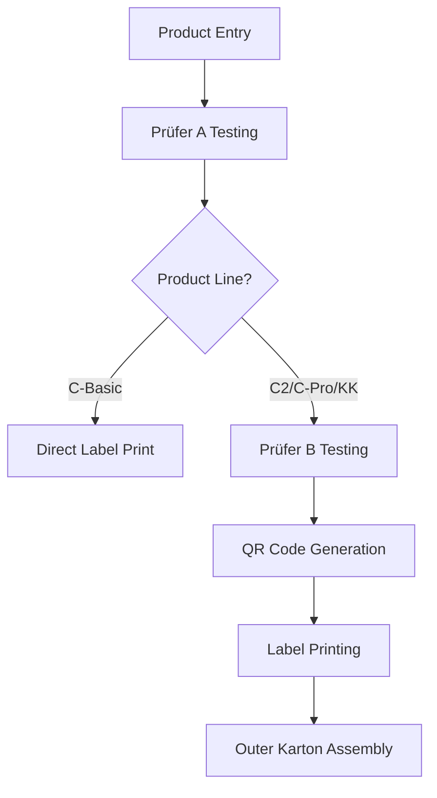

# Etikettdrucker Software Architecture Document
## Part 1: System Overview & Business Context

### Document Information
- **Project**: Rotoclear Etikettdrucker System
- **Version**: 1.0
- **Last Updated**: August 12, 2025
- **Architect**: System Architecture Team
- **Document Status**: Draft

---

## 1. Executive Summary

The Etikettdrucker system is a specialized label printing and quality management application designed for Rotoclear's manufacturing and testing processes. The system manages product lifecycle from initial testing through final packaging, with integrated QR code generation, multi-stage quality control, and comprehensive user management.

### 1.1 Business Drivers
- **Quality Assurance**: Standardized testing protocols for different product lines
- **Traceability**: Complete product lifecycle tracking with QR codes
- **Compliance**: Structured approval workflows and documentation
- **Efficiency**: Streamlined label printing and packaging processes
- **Security**: Role-based access control for sensitive operations

### 1.2 Key Stakeholders
- **Manufacturing Teams**: Product testing and assembly
- **Quality Control**: Testing validation and approval
- **Management**: Oversight and reporting
- **System Administrators**: User and system management

---

## 2. Business Context & Domain Model

### 2.1 Product Lines Supported
The system manages four distinct product lines, each with unique requirements:

#### C-Basic Products
- **Purpose**: Entry-level product line
- **Testing Stages**: Prüfer A only
- **Characteristics**: Simplified workflow, basic quality controls

#### C2 Products  
- **Purpose**: Mid-range product line with DMG/RC/EDU/DEMO configurations
- **Testing Stages**: Prüfer A → Prüfer B → QR Preview → Label Printing
- **Characteristics**: Configuration-dependent article numbers and specifications

#### C-Pro Products
- **Purpose**: Professional product line with storage variants (256GB, 1TB, 4TB)
- **Testing Stages**: Prüfer A → Prüfer B → QR Preview → Label Printing
- **Characteristics**: Storage-dependent specifications and pricing

#### KK Products
- **Purpose**: Specialized product line
- **Testing Stages**: Prüfer A → Prüfer B → QR Preview → Label Printing
- **Characteristics**: Unique workflow with file upload capabilities

### 2.2 Core Business Processes

#### Testing Workflow

#### Quality Control Stages
1. **Prüfer A**: Initial component testing and validation
2. **Prüfer B**: Final assembly testing and approval
3. **Label Generation**: QR code and specification printing
4. **Packaging**: Outer carton assembly with component tracking

### 2.3 User Roles & Permissions

#### Administrative Roles
- **ADMIN**: Full system access, user management, system configuration
- **MANAGEMENT**: Cross-product oversight, reporting, user supervision

#### Operational Roles
- **PRUEFER_AB**: Complete testing authority across all stages
- **PRUEFER_A**: Limited to initial testing stages
- **PRUEFER_B**: Limited to final testing and approval stages
- **VIEWER**: Read-only access for monitoring and reporting

---

## 3. System Architecture Vision

### 3.1 Architectural Principles

#### Modularity
- **Product-Specific Modules**: Separate routes and logic for each product line
- **Shared Components**: Reusable UI components and business logic
- **Clear Separation**: Distinct concerns for testing, printing, and management

#### Scalability
- **Horizontal Scaling**: Stateless application design
- **Database Optimization**: Efficient queries and indexing strategies
- **Caching Strategy**: Session-based and application-level caching

#### Security
- **Authentication**: JWT-based session management
- **Authorization**: Role-based access control (RBAC)
- **Data Protection**: Encrypted sensitive data and secure API endpoints

#### Maintainability
- **TypeScript**: Strong typing throughout the application
- **Component Architecture**: Reusable Svelte components
- **Documentation**: Comprehensive code and API documentation

### 3.2 Technology Stack Rationale

#### Frontend: SvelteKit
**Why Chosen:**
- **Performance**: Compile-time optimizations, minimal runtime overhead
- **Developer Experience**: Intuitive syntax, excellent TypeScript support
- **Full-Stack**: Integrated SSR and API capabilities
- **Bundle Size**: Smaller production bundles compared to React/Vue

#### Backend: SvelteKit + Node.js
**Why Chosen:**
- **Unified Stack**: Single technology for frontend and backend
- **Type Safety**: Shared types between client and server
- **Rapid Development**: Integrated routing and API development

#### Database: PostgreSQL + Prisma
**Why Chosen:**
- **Reliability**: ACID compliance for critical quality data
- **Type Safety**: Prisma provides end-to-end type safety
- **Scalability**: Robust performance under load
- **Migrations**: Version-controlled schema evolution

#### Label Printing: ZPL (Zebra Programming Language)
**Why Chosen:**
- **Industry Standard**: Wide compatibility with industrial printers
- **Precision**: Exact positioning and formatting control
- **Reliability**: Proven technology for manufacturing environments

### 3.3 Quality Attributes

#### Performance Targets
- **Page Load Time**: < 2 seconds for all primary workflows
- **Database Response**: < 100ms for standard queries
- **Label Generation**: < 3 seconds from submission to print-ready

#### Reliability Requirements
- **Uptime**: 99.5% availability during business hours
- **Data Integrity**: Zero data loss tolerance for quality records
- **Backup Strategy**: Daily automated backups with point-in-time recovery

#### Security Requirements
- **Authentication**: Multi-factor authentication capability
- **Session Management**: Secure token handling with appropriate expiration
- **Audit Trail**: Complete logging of all quality-critical operations

---

## 4. System Boundaries & Constraints

### 4.1 System Boundaries

#### In Scope
- Quality testing workflows for all product lines
- Label printing and QR code generation
- User authentication and authorization
- Outer carton assembly tracking
- Basic reporting and dashboard functionality

#### Out of Scope
- Inventory management integration
- Advanced analytics and business intelligence
- Third-party ERP system integration
- Mobile application development (Phase 1)

### 4.2 Technical Constraints

#### Infrastructure
- **Windows Environment**: Primary deployment on Windows Server
- **Network Limitations**: Limited to local network deployment initially
- **Printer Integration**: Must support existing Zebra label printers

#### Development Constraints
- **Browser Support**: Modern browsers only (Chrome, Firefox, Edge)
- **Language Requirements**: German UI with potential English localization
- **Development Team**: Small team requiring maintainable, well-documented code

### 4.3 Business Constraints

#### Compliance
- **Quality Standards**: Must support ISO quality management processes
- **Audit Requirements**: Complete traceability of all testing activities
- **Data Retention**: Minimum 7-year retention for quality records

#### Operational
- **Training**: Minimal training requirements for existing staff
- **Migration**: Smooth transition from existing manual processes
- **Downtime**: Limited maintenance windows during production hours

---

This concludes Part 1 of the architecture document. The next parts will cover:
- Part 2: Technical Architecture & Component Design
- Part 3: Data Architecture & Database Design  
- Part 4: Security Architecture & Implementation
- Part 5: Deployment Architecture & DevOps Strategy
- Part 6: Development Standards & Guidelines

