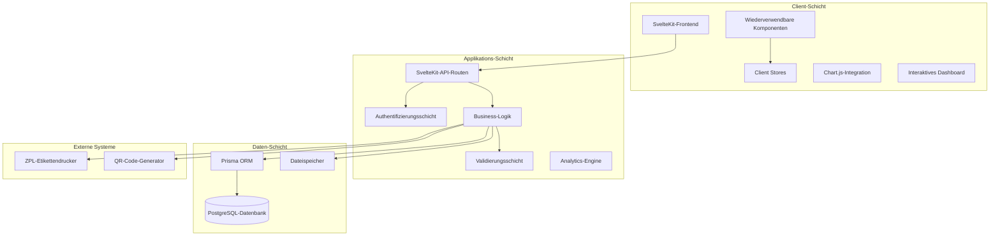

# Teil 2: Technische Architektur & Komponentendesign

---

## 5. Überblick über die technische Architektur

### 5.1 High-Level-Architektur



### 5.2 Architekturmuster

#### Frontend-Architektur: Komponentenbasiertes Design

* **Page-Komponenten**: Routen­spezifische Komponenten mit domänennaher Logik
* **UI-Komponenten**: Wiederverwendbare Präsentationsbausteine
* **Store-Pattern**: Zentrales Zustandsmanagement via Svelte Stores
* **Formular-Handling**: Einheitliche Muster für Validierung und Submit

#### Backend-Architektur: Geschichtete Architektur

* **Präsentationsschicht**: SvelteKit-API-Routen übernehmen HTTP-Handling
* **Business-Logik-Schicht**: Kernlogik und Workflows
* **Datenzugriffsschicht**: Prisma ORM als Abstraktion zur Datenbank
* **Infrastruktur-Schicht**: Integrationen zu externen Diensten

---

## 6. Komponentenarchitektur

### 6.1 Frontend-Komponenten-Hierarchie

#### Core-Layout-Komponenten

```
src/routes/
├── +layout.svelte          # Globales Layout mit Navigation
├── +page.svelte            # Dashboard/Landing mit Analysen
├── dashboard/              # Dashboard-Analyse­module
│   ├── cbasic/+page.svelte # C-Basic-Dashboard
│   ├── c2/+page.svelte     # C2-Dashboard
│   └── cpro/+page.svelte   # C-Pro-Dashboard
└── components/
    ├── Header.svelte       # Navigationskopf
    ├── Footer.svelte       # Fußbereich
    └── RouteGuard.svelte   # Autorisierungs-Wrapper
```

#### Produktspezifische Komponenten

```
src/routes/
├── cbasic/                 # C-Basic-Workflows
│   ├── pruefer-a/
│   ├── pruefer-b/          # Verbesserte Änderungsdetektion
│   ├── qr-preview/
│   └── print-label/
├── c2/                     # C2-Workflows
│   ├── pruefer-a/
│   ├── pruefer-b/          # Verbesserte Änderungsdetektion
│   ├── qr-preview/
│   └── print-label/
├── cpro/                   # C-Pro-Workflows
│   ├── pruefer-a/
│   ├── pruefer-b/          # Verbesserte Änderungsdetektion
│   ├── qr-preview/
│   └── print-label/
└── kk/                     # KK-Workflows
    ├── pruefer-a/
    └── pruefer-b/          # Verbesserte Änderungsdetektion
```

#### Geteilte UI-Komponenten

```
src/lib/components/
├── Icon.svelte             # SVG-Icon-System
├── BooleanRadio.svelte     # Ja/Nein-Auswahlgruppen
├── SelectRadio.svelte      # Auswahlsteuerelemente
├── FormInput.svelte        # Standardisierte Formulareingaben
├── Modal.svelte            # Dialogfenster
├── LoadingSpinner.svelte   # Ladeindikatoren
├── DataTable.svelte        # Tabellarische Darstellung
├── Chart.svelte            # Wrapper für Chart.js
└── Tooltip.svelte          # Interaktive Tooltips
```

### 6.2 Designprinzipien für Komponenten

#### Single Responsibility (Einzelverantwortung)

Jede Komponente hat einen klaren, fokussierten Zweck:

* **BooleanRadio**: Handhabt ausschließlich Ja/Nein-Auswahlen
* **Icon**: Rendert SVG-Icons konsistent
* **Modal**: Verwaltet Verhalten von Popup-Dialogen

#### Composition over Inheritance (Komposition vor Vererbung)

Komponenten werden zusammengesetzt statt erweitert:

```svelte
<Modal bind:show={showConfirmation}>
  <ConfirmationDialog 
    message="Benutzer löschen?"
    on:confirm={handleDelete}
    on:cancel={() => showConfirmation = false}
  />
</Modal>
```

#### Props-Schnittstellen

Klare, typisierte Interfaces für alle Komponenten:

```typescript
interface IconProps {
  name: string;           // Erforderlich: Icon-Name
  size?: number;          // Optional: Größe in Pixeln
  color?: string;         // Optional: individuelle Farbe
  className?: string;     // Optional: zusätzliche CSS-Klassen
}
```

### 6.3 Architektur der Zustandsverwaltung

#### Clientseitige Stores

```typescript
// src/lib/stores/
├── auth.ts               # Authentifizierungszustand
├── user.ts               # Aktuelle Benutzerinformationen
├── navigation.ts         # Navigationszustand
└── notifications.ts      # Toast-/Alarmmeldungen
```

#### Store-Designmuster

```typescript
// Beispiel: Authentication Store
interface AuthState {
  isAuthenticated: boolean;
  isLoading: boolean;
  user: User | null;
  error: string | null;
}

export const authStore = writable<AuthState>({
  isAuthenticated: false,
  isLoading: true,
  user: null,
  error: null
});
```

---

## 7. API-Architektur

### 7.1 Struktur der API-Routen

#### RESTful-Endpunktdesign

```
src/routes/api/
├── auth/
│   ├── login/+server.ts      # POST /api/auth/login
│   ├── logout/+server.ts     # POST /api/auth/logout
│   └── me/+server.ts         # GET  /api/auth/me
├── users/
│   ├── +server.ts            # GET, POST  /api/users
│   └── [id]/+server.ts       # GET, PUT, DELETE /api/users/:id
├── products/
│   ├── cbasic/
│   │   ├── +server.ts        # C-Basic-Operationen
│   │   └── stats/+server.ts  # C-Basic-Analysen
│   ├── c2/
│   │   ├── +server.ts        # C2-Operationen
│   │   ├── qr/+server.ts     # C2-QR-Erzeugung
│   │   └── stats/+server.ts  # C2-Analysen
│   ├── cpro/
│   │   ├── +server.ts        # C-Pro-Operationen
│   │   ├── qr/+server.ts     # C-Pro-QR-Erzeugung
│   │   └── stats/+server.ts  # C-Pro-Analysen
│   └── kk/+server.ts         # KK-Operationen
├── labels/
│   └── print/+server.ts      # POST /api/labels/print
├── dashboard/
│   ├── monthly/+server.ts    # Monatliche Produktionsstatistiken
│   └── analytics/+server.ts  # Dashboard-Analytik
└── outerkarton/
    └── +server.ts            # Außenkarton-Operationen
```

### 7.2 API-Designstandards

#### Request-/Response-Format

```typescript
// Standard-API-Response-Interface
interface ApiResponse<T> {
  success: boolean;
  data?: T;
  error?: string;
  errors?: Record<string, string[]>;
  meta?: {
    timestamp: string;
    requestId: string;
  };
}

// Beispielverwendung
export async function POST({ request }: RequestEvent): Promise<Response> {
  try {
    const data = await request.json();
    const result = await createUser(data);
    
    return json<ApiResponse<User>>({
      success: true,
      data: result,
      meta: {
        timestamp: new Date().toISOString(),
        requestId: crypto.randomUUID()
      }
    });
  } catch (error) {
    return json<ApiResponse<never>>({
      success: false,
      error: (error as Error).message
    }, { status: 400 });
  }
}
```

#### Authentifizierungs-Middleware

```typescript
// Wiederverwendbare Authentifizierungsprüfung
export async function authenticateRequest(request: Request): Promise<User | null> {
  const sessionCookie = request.headers.get('cookie');
  if (!sessionCookie) return null;
  
  const session = parseSessionCookie(sessionCookie);
  if (!session || isExpired(session)) return null;
  
  return await getUserById(session.userId);
}

// Autorisierungs-Helper
export function requireRole(requiredRole: UserRole) {
  return async (user: User | null): Promise<boolean> => {
    if (!user) return false;
    return hasPermission(user.role, requiredRole);
  };
}
```

### 7.3 Strategie zur Fehlerbehandlung

#### Zentralisierte Fehlerklassen

```typescript
// src/lib/errors.ts
export class AppError extends Error {
  constructor(
    message: string,
    public code: string,
    public statusCode: number = 500
  ) {
    super(message);
    this.name = 'AppError';
  }
}

export class ValidationError extends AppError {
  constructor(message: string, public fields: Record<string, string[]>) {
    super(message, 'VALIDATION_ERROR', 400);
  }
}

export class AuthenticationError extends AppError {
  constructor(message: string = 'Authentifizierung erforderlich') {
    super(message, 'AUTH_REQUIRED', 401);
  }
}
```

#### Globaler Error-Handler

```typescript
// src/hooks.server.ts
export const handleError: HandleServerError = ({ error, event }) => {
  console.error('Serverfehler:', error);
  
  if (error instanceof AppError) {
    return {
      message: error.message,
      code: error.code
    };
  }
  
  return {
    message: 'Interner Serverfehler',
    code: 'INTERNAL_ERROR'
  };
};
```

---

## 8. Architektur der Geschäftslogik

### 8.1 Domain-Services

#### Produkt-Testservices

```typescript
// src/lib/services/testing/
├── PrueferAService.ts        # Logik Prüfer A
├── PrueferBService.ts        # Logik Prüfer B
├── ValidationService.ts      # Stufenübergreifende Validierung
└── TestingWorkflow.ts        # Workflow-Orchestrierung
```

#### Etikettenerzeugungs-Services

```typescript
// src/lib/services/labels/
├── QRCodeService.ts          # QR-Code-Erzeugung
├── ZPLService.ts             # ZPL-Template-Verwaltung
├── LabelPrintService.ts      # Verwaltung von Druckaufträgen
└── TemplateService.ts        # Label-Templatesystem
```

### 8.2 Service-Designmuster

#### Service-Interface-Beispiel

```typescript
// Basisinterface für Testing-Services
interface ITestingService {
  validateInput(data: TestingData): ValidationResult;
  saveTestResults(data: TestingData): Promise<TestingRecord>;
  generateQRCode(data: TestingData): Promise<string>;
  createLabel(data: TestingData): Promise<LabelData>;
}

// Implementierung
export class PrueferAService implements ITestingService {
  constructor(
    private database: PrismaClient,
    private validator: ValidationService
  ) {}
  
  async validateInput(data: TestingData): Promise<ValidationResult> {
    return this.validator.validatePrueferA(data);
  }
  
  async saveTestResults(data: TestingData): Promise<TestingRecord> {
    return this.database.testingRecord.create({
      data: {
        ...data,
        stage: 'PRUEFER_A',
        timestamp: new Date()
      }
    });
  }
}
```

### 8.3 Workflow-Orchestrierung

#### Testing-Workflow-Engine

```typescript
// src/lib/workflows/TestingWorkflow.ts
export class TestingWorkflow {
  constructor(
    private prueferA: PrueferAService,
    private prueferB: PrueferBService,
    private labelService: LabelService
  ) {}
  
  async processProduct(productData: ProductData): Promise<WorkflowResult> {
    // Stufe 1: Prüfer A
    const prueferAResult = await this.prueferA.process(productData);
    if (!prueferAResult.success) {
      return { success: false, stage: 'PRUEFER_A', error: prueferAResult.error };
    }
    
    // Stufe 2: Prüfer B (falls erforderlich)
    if (this.requiresPrueferB(productData.productLine)) {
      const prueferBResult = await this.prueferB.process(productData);
      if (!prueferBResult.success) {
        return { success: false, stage: 'PRUEFER_B', error: prueferBResult.error };
      }
    }
    
    // Stufe 3: Etikettenerzeugung
    const labelResult = await this.labelService.generate(productData);
    
    return {
      success: true,
      data: {
        prueferA: prueferAResult.data,
        prueferB: prueferBResult?.data,
        label: labelResult.data
      }
    };
  }
}
```

---

## 9. Integrationsarchitektur

### 9.1 Integrationen externer Systeme

#### Etikettendrucker-Integration

```typescript
// src/lib/integrations/printer/ZPLPrinter.ts
export class ZPLPrinter {
  constructor(private config: PrinterConfig) {}
  
  async printLabel(zplContent: string): Promise<PrintResult> {
    // ZPL zum Drucker senden (Netzwerk oder USB)
    try {
      await this.sendToPrinter(zplContent);
      return { success: true, jobId: this.generateJobId() };
    } catch (error) {
      return { success: false, error: (error as Error).message };
    }
  }
  
  private async sendToPrinter(content: string): Promise<void> {
    // Implementierung hängt von der Verbindungsmethode ab
    // Netzwerk: TCP-Socket-Verbindung
    // USB: Serielle Schnittstelle
  }
}
```

#### QR-Code-Erzeugung

```typescript
// src/lib/integrations/qr/QRGenerator.ts
export class QRGenerator {
  async generate(data: QRData): Promise<string> {
    const qrString = this.formatQRString(data);
    return this.createQRCode(qrString);
  }
  
  private formatQRString(data: QRData): string {
    return `${data.serialNumber}|${data.articleNumber}|${data.timestamp}`;
  }
  
  private async createQRCode(content: string): Promise<string> {
    // QR-Code als SVG-String erzeugen
    // z. B. mit der "qrcode"-Bibliothek o. Ä.
  }
}
```

### 9.2 Dateisystem-Integration

#### File-Upload-Handling

```typescript
// src/lib/services/FileService.ts
export class FileService {
  private readonly uploadPath = './uploads';
  
  async saveUploadedFile(file: File, context: FileContext): Promise<string> {
    const filename = this.generateFileName(file, context);
    const filepath = path.join(this.uploadPath, context.type, filename);
    
    await this.ensureDirectory(path.dirname(filepath));
    await this.writeFile(filepath, file);
    
    return filepath;
  }
  
  private generateFileName(file: File, context: FileContext): string {
    const timestamp = new Date().toISOString().replace(/[:.]/g, '-');
    const extension = path.extname(file.name);
    return `${context.serialNumber}_${timestamp}${extension}`;
  }
}
```

---
