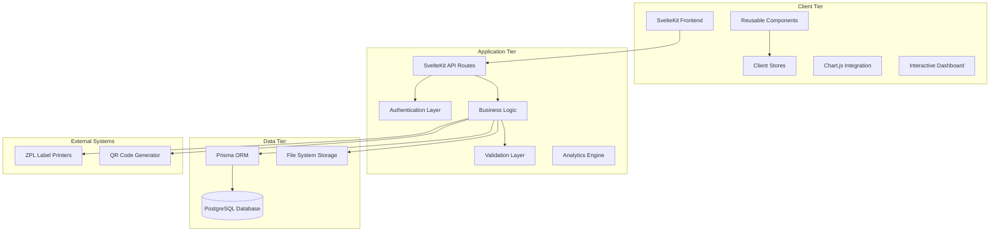

# Part 2: Technical Architecture & Component Design

---

## 5. Technical Architecture Overview

### 5.1 High-Level Architecture



### 5.2 Architectural Patterns

#### Frontend Architecture: Component-Based Design
- **Page Components**: Route-specific components handling business logic
- **UI Components**: Reusable presentation components
- **Store Pattern**: Centralized state management using Svelte stores
- **Form Handling**: Consistent validation and submission patterns

#### Backend Architecture: Layered Architecture
- **Presentation Layer**: SvelteKit API routes handling HTTP requests
- **Business Logic Layer**: Core domain logic and workflows
- **Data Access Layer**: Prisma ORM providing database abstraction
- **Infrastructure Layer**: External service integrations

---

## 6. Component Architecture

### 6.1 Frontend Component Hierarchy

#### Core Layout Components
```
src/routes/
├── +layout.svelte          # Global layout with navigation
├── +page.svelte            # Dashboard/landing page with analytics
├── dashboard/              # Dashboard analytics modules
│   ├── cbasic/+page.svelte # C-Basic dashboard
│   ├── c2/+page.svelte     # C2 dashboard
│   └── cpro/+page.svelte   # C-Pro dashboard
└── components/
    ├── Header.svelte       # Navigation header
    ├── Footer.svelte       # Application footer
    └── RouteGuard.svelte   # Authorization wrapper
```

#### Product-Specific Components
```
src/routes/
├── cbasic/                 # C-Basic product workflows
│   ├── pruefer-a/
│   ├── pruefer-b/          # Enhanced change detection
│   ├── qr-preview/
│   └── print-label/
├── c2/                     # C2 product workflows
│   ├── pruefer-a/
│   ├── pruefer-b/          # Enhanced change detection
│   ├── qr-preview/
│   └── print-label/
├── cpro/                   # C-Pro product workflows
│   ├── pruefer-a/
│   ├── pruefer-b/          # Enhanced change detection
│   ├── qr-preview/
│   └── print-label/
└── kk/                     # KK product workflows
    ├── pruefer-a/
    └── pruefer-b/          # Enhanced change detection
```

#### Shared UI Components
```
src/lib/components/
├── Icon.svelte             # SVG icon system
├── BooleanRadio.svelte     # Radio button groups
├── SelectRadio.svelte      # Selection controls
├── FormInput.svelte        # Standardized form inputs
├── Modal.svelte            # Popup dialogs
├── LoadingSpinner.svelte   # Loading indicators
├── DataTable.svelte        # Tabular data display
├── Chart.svelte            # Chart.js integration wrapper
└── Tooltip.svelte          # Interactive tooltip component
```

### 6.2 Component Design Principles

#### Single Responsibility
Each component has a clear, focused purpose:
- **BooleanRadio**: Handles yes/no selections only
- **Icon**: Renders SVG icons with consistent styling
- **Modal**: Manages popup dialog behavior

#### Composition Over Inheritance
Components compose together rather than extend:
```svelte
<Modal bind:show={showConfirmation}>
  <ConfirmationDialog 
    message="Delete user?"
    on:confirm={handleDelete}
    on:cancel={() => showConfirmation = false}
  />
</Modal>
```

#### Props Interface Design
Clear, typed interfaces for all components:
```typescript
interface IconProps {
  name: string;           // Required: icon identifier
  size?: number;          // Optional: icon size in pixels
  color?: string;         // Optional: custom color
  className?: string;     // Optional: additional CSS classes
}
```

### 6.3 State Management Architecture

#### Client-Side Stores
```typescript
// src/lib/stores/
├── auth.ts               # Authentication state
├── user.ts              # Current user information  
├── navigation.ts        # Navigation state
└── notifications.ts     # Toast/alert messages
```

#### Store Design Pattern
```typescript
// Example: Authentication Store
interface AuthState {
  isAuthenticated: boolean;
  isLoading: boolean;
  user: User | null;
  error: string | null;
}

export const authStore = writable<AuthState>({
  isAuthenticated: false,
  isLoading: true,
  user: null,
  error: null
});
```

---

## 7. API Architecture

### 7.1 API Route Structure

#### RESTful Endpoint Design
```
src/routes/api/
├── auth/
│   ├── login/+server.ts      # POST /api/auth/login
│   ├── logout/+server.ts     # POST /api/auth/logout
│   └── me/+server.ts         # GET /api/auth/me
├── users/
│   ├── +server.ts            # GET, POST /api/users
│   └── [id]/+server.ts       # GET, PUT, DELETE /api/users/:id
├── products/
│   ├── cbasic/
│   │   ├── +server.ts        # C-Basic operations
│   │   └── stats/+server.ts  # C-Basic analytics
│   ├── c2/
│   │   ├── +server.ts        # C2 operations
│   │   ├── qr/+server.ts     # C2 QR generation
│   │   └── stats/+server.ts  # C2 analytics
│   ├── cpro/
│   │   ├── +server.ts        # C-Pro operations
│   │   ├── qr/+server.ts     # C-Pro QR generation
│   │   └── stats/+server.ts  # C-Pro analytics
│   └── kk/+server.ts         # KK operations
├── labels/
│   └── print/+server.ts      # POST /api/labels/print
├── dashboard/
│   ├── monthly/+server.ts    # Monthly production stats
│   └── analytics/+server.ts  # Dashboard analytics
└── outerkarton/
    └── +server.ts            # Outer carton operations
```

### 7.2 API Design Standards

#### Request/Response Format
```typescript
// Standard API Response Interface
interface ApiResponse<T> {
  success: boolean;
  data?: T;
  error?: string;
  errors?: Record<string, string[]>;
  meta?: {
    timestamp: string;
    requestId: string;
  };
}

// Example Usage
export async function POST({ request }: RequestEvent): Promise<Response> {
  try {
    const data = await request.json();
    const result = await createUser(data);
    
    return json<ApiResponse<User>>({
      success: true,
      data: result,
      meta: {
        timestamp: new Date().toISOString(),
        requestId: crypto.randomUUID()
      }
    });
  } catch (error) {
    return json<ApiResponse<never>>({
      success: false,
      error: error.message
    }, { status: 400 });
  }
}
```

#### Authentication Middleware
```typescript
// Reusable authentication check
export async function authenticateRequest(request: Request): Promise<User | null> {
  const sessionCookie = request.headers.get('cookie');
  if (!sessionCookie) return null;
  
  const session = parseSessionCookie(sessionCookie);
  if (!session || isExpired(session)) return null;
  
  return await getUserById(session.userId);
}

// Authorization middleware
export function requireRole(requiredRole: UserRole) {
  return async (user: User | null): Promise<boolean> => {
    if (!user) return false;
    return hasPermission(user.role, requiredRole);
  };
}
```

### 7.3 Error Handling Strategy

#### Centralized Error Handling
```typescript
// src/lib/errors.ts
export class AppError extends Error {
  constructor(
    message: string,
    public code: string,
    public statusCode: number = 500
  ) {
    super(message);
    this.name = 'AppError';
  }
}

export class ValidationError extends AppError {
  constructor(message: string, public fields: Record<string, string[]>) {
    super(message, 'VALIDATION_ERROR', 400);
  }
}

export class AuthenticationError extends AppError {
  constructor(message: string = 'Authentication required') {
    super(message, 'AUTH_REQUIRED', 401);
  }
}
```

#### Global Error Handler
```typescript
// src/hooks.server.ts
export const handleError: HandleServerError = ({ error, event }) => {
  console.error('Server error:', error);
  
  if (error instanceof AppError) {
    return {
      message: error.message,
      code: error.code
    };
  }
  
  return {
    message: 'Internal server error',
    code: 'INTERNAL_ERROR'
  };
};
```

---

## 8. Business Logic Architecture

### 8.1 Domain Services

#### Product Testing Services
```typescript
// src/lib/services/testing/
├── PrueferAService.ts        # Prüfer A testing logic
├── PrueferBService.ts        # Prüfer B testing logic
├── ValidationService.ts     # Cross-stage validation
└── TestingWorkflow.ts       # Workflow orchestration
```

#### Label Generation Services
```typescript
// src/lib/services/labels/
├── QRCodeService.ts         # QR code generation
├── ZPLService.ts           # ZPL template management
├── LabelPrintService.ts    # Print job management
└── TemplateService.ts      # Label template system
```

### 8.2 Service Design Pattern

#### Service Interface Example
```typescript
// Service base interface
interface ITestingService {
  validateInput(data: TestingData): ValidationResult;
  saveTestResults(data: TestingData): Promise<TestingRecord>;
  generateQRCode(data: TestingData): Promise<string>;
  createLabel(data: TestingData): Promise<LabelData>;
}

// Implementation
export class PrueferAService implements ITestingService {
  constructor(
    private database: PrismaClient,
    private validator: ValidationService
  ) {}
  
  async validateInput(data: TestingData): Promise<ValidationResult> {
    return this.validator.validatePrueferA(data);
  }
  
  async saveTestResults(data: TestingData): Promise<TestingRecord> {
    return this.database.testingRecord.create({
      data: {
        ...data,
        stage: 'PRUEFER_A',
        timestamp: new Date()
      }
    });
  }
}
```

### 8.3 Workflow Orchestration

#### Testing Workflow Engine
```typescript
// src/lib/workflows/TestingWorkflow.ts
export class TestingWorkflow {
  constructor(
    private prueferA: PrueferAService,
    private prueferB: PrueferBService,
    private labelService: LabelService
  ) {}
  
  async processProduct(productData: ProductData): Promise<WorkflowResult> {
    // Stage 1: Prüfer A
    const prueferAResult = await this.prueferA.process(productData);
    if (!prueferAResult.success) {
      return { success: false, stage: 'PRUEFER_A', error: prueferAResult.error };
    }
    
    // Stage 2: Prüfer B (if required)
    if (this.requiresPrueferB(productData.productLine)) {
      const prueferBResult = await this.prueferB.process(productData);
      if (!prueferBResult.success) {
        return { success: false, stage: 'PRUEFER_B', error: prueferBResult.error };
      }
    }
    
    // Stage 3: Label Generation
    const labelResult = await this.labelService.generate(productData);
    
    return {
      success: true,
      data: {
        prueferA: prueferAResult.data,
        prueferB: prueferBResult?.data,
        label: labelResult.data
      }
    };
  }
}
```

---

## 9. Integration Architecture

### 9.1 External System Integrations

#### Label Printer Integration
```typescript
// src/lib/integrations/printer/ZPLPrinter.ts
export class ZPLPrinter {
  constructor(private config: PrinterConfig) {}
  
  async printLabel(zplContent: string): Promise<PrintResult> {
    // Send ZPL to printer via network or USB
    try {
      await this.sendToPrinter(zplContent);
      return { success: true, jobId: this.generateJobId() };
    } catch (error) {
      return { success: false, error: error.message };
    }
  }
  
  private async sendToPrinter(content: string): Promise<void> {
    // Implementation depends on printer connection method
    // Network: TCP socket connection
    // USB: Serial port communication
  }
}
```

#### QR Code Generation
```typescript
// src/lib/integrations/qr/QRGenerator.ts
export class QRGenerator {
  async generate(data: QRData): Promise<string> {
    const qrString = this.formatQRString(data);
    return this.createQRCode(qrString);
  }
  
  private formatQRString(data: QRData): string {
    return `${data.serialNumber}|${data.articleNumber}|${data.timestamp}`;
  }
  
  private async createQRCode(content: string): Promise<string> {
    // Generate QR code as SVG string
    // Using qrcode library or similar
  }
}
```

### 9.2 File System Integration

#### File Upload Handling
```typescript
// src/lib/services/FileService.ts
export class FileService {
  private readonly uploadPath = './uploads';
  
  async saveUploadedFile(file: File, context: FileContext): Promise<string> {
    const filename = this.generateFileName(file, context);
    const filepath = path.join(this.uploadPath, context.type, filename);
    
    await this.ensureDirectory(path.dirname(filepath));
    await this.writeFile(filepath, file);
    
    return filepath;
  }
  
  private generateFileName(file: File, context: FileContext): string {
    const timestamp = new Date().toISOString().replace(/[:.]/g, '-');
    const extension = path.extname(file.name);
    return `${context.serialNumber}_${timestamp}${extension}`;
  }
}
```

---