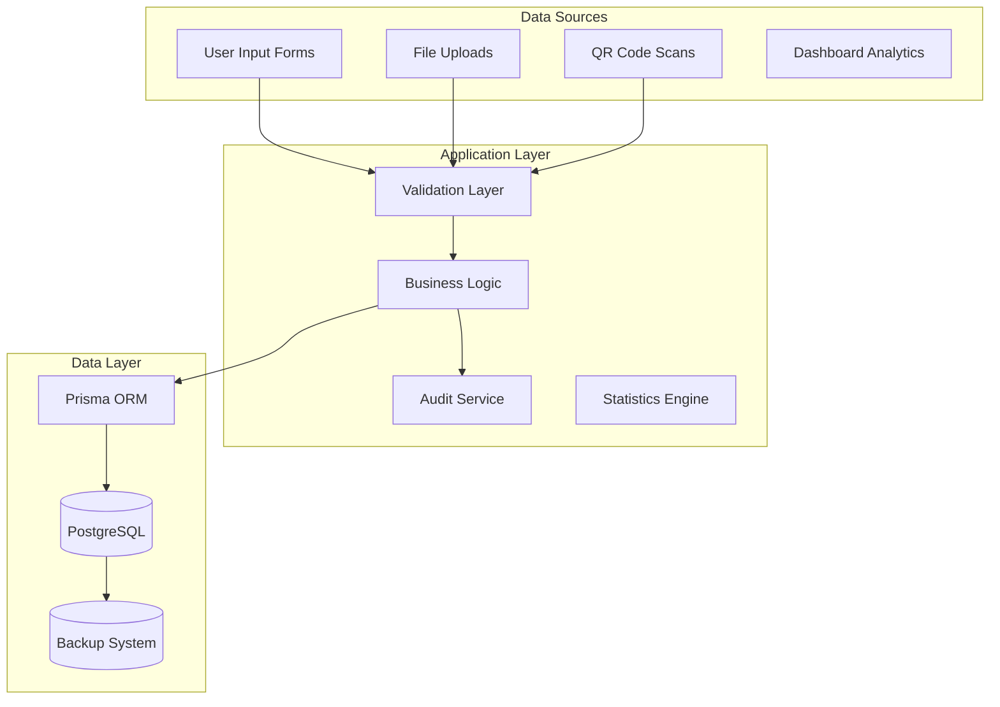
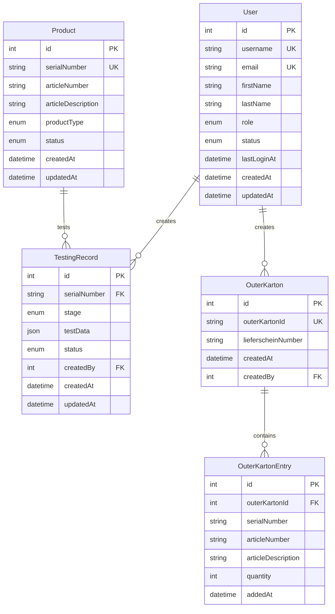

# Part 3: Data Architecture & Database Design

---

## 10. Data Architecture Overview

### 10.1 Data Architecture Strategy

#### Core Principles
- **Data Integrity**: ACID compliance for all quality-critical transactions
- **Traceability**: Complete audit trail for all product testing activities
- **Performance**: Optimized queries for real-time operations and analytics
- **Scalability**: Design for future growth in product volume and complexity
- **Analytics**: Built-in support for business intelligence and reporting

#### Data Flow Architecture


### 10.2 Database Technology Rationale

#### PostgreSQL Selection
**Advantages:**
- **ACID Compliance**: Critical for quality management data
- **Advanced Features**: JSON support, full-text search, advanced indexing
- **Scalability**: Proven performance at enterprise scale
- **Type Safety**: Strong typing aligns with TypeScript application
- **Ecosystem**: Excellent Prisma integration and tooling

#### Prisma ORM Benefits
- **Type Safety**: End-to-end type safety from database to frontend
- **Migration Management**: Version-controlled schema evolution
- **Query Optimization**: Intelligent query generation and optimization
- **Developer Experience**: Intuitive API with excellent TypeScript support

---

## 11. Database Schema Design

### 11.1 Core Entity Relationships



### 11.2 Detailed Schema Specifications

#### User Management Schema
```sql
-- Users table with comprehensive role-based access
CREATE TABLE users (
    id SERIAL PRIMARY KEY,
    username VARCHAR(50) UNIQUE NOT NULL,
    email VARCHAR(255) UNIQUE NOT NULL,
    password_hash VARCHAR(255) NOT NULL,
    first_name VARCHAR(100) NOT NULL,
    last_name VARCHAR(100) NOT NULL,
    role user_role NOT NULL DEFAULT 'VIEWER',
    status user_status NOT NULL DEFAULT 'ACTIVE',
    last_login_at TIMESTAMP WITH TIME ZONE,
    created_at TIMESTAMP WITH TIME ZONE DEFAULT NOW(),
    updated_at TIMESTAMP WITH TIME ZONE DEFAULT NOW(),
    created_by INTEGER REFERENCES users(id)
);

-- User roles enumeration
CREATE TYPE user_role AS ENUM (
    'ADMIN',
    'MANAGEMENT', 
    'PRUEFER_AB',
    'PRUEFER_A',
    'PRUEFER_B',
    'VIEWER'
);

-- User status enumeration  
CREATE TYPE user_status AS ENUM (
    'ACTIVE',
    'INACTIVE',
    'SUSPENDED'
);
```

#### Product Testing Schema
```sql
-- Products master table
CREATE TABLE products (
    id SERIAL PRIMARY KEY,
    serial_number VARCHAR(100) UNIQUE NOT NULL,
    article_number VARCHAR(50) NOT NULL,
    article_description TEXT NOT NULL,
    product_type product_type_enum NOT NULL,
    configuration VARCHAR(50), -- For C2: DMG/RC/EDU/DEMO
    storage_size VARCHAR(20),  -- For C-Pro: 256GB/1TB/4TB
    status product_status NOT NULL DEFAULT 'IN_TESTING',
    created_at TIMESTAMP WITH TIME ZONE DEFAULT NOW(),
    updated_at TIMESTAMP WITH TIME ZONE DEFAULT NOW()
);

-- Testing records with flexible JSON data storage
CREATE TABLE testing_records (
    id SERIAL PRIMARY KEY,
    serial_number VARCHAR(100) NOT NULL REFERENCES products(serial_number),
    stage testing_stage NOT NULL,
    test_data JSONB NOT NULL,
    status record_status NOT NULL DEFAULT 'PENDING',
    qr_code TEXT, -- Generated QR code content
    label_data JSONB, -- ZPL template data
    created_by INTEGER NOT NULL REFERENCES users(id),
    approved_by INTEGER REFERENCES users(id),
    created_at TIMESTAMP WITH TIME ZONE DEFAULT NOW(),
    updated_at TIMESTAMP WITH TIME ZONE DEFAULT NOW(),
    
    -- Ensure one record per stage per product
    UNIQUE(serial_number, stage)
);

-- Product type enumeration
CREATE TYPE product_type_enum AS ENUM (
    'CBASIC',
    'C2', 
    'CPRO',
    'KK'
);

-- Testing stage enumeration
CREATE TYPE testing_stage AS ENUM (
    'PRUEFER_A',
    'PRUEFER_B'
);

-- Record status enumeration
CREATE TYPE record_status AS ENUM (
    'PENDING',
    'APPROVED',
    'REJECTED',
    'COMPLETED'
);
```

#### Outer Karton Schema
```sql
-- Outer karton master records
CREATE TABLE outer_kartons (
    id SERIAL PRIMARY KEY,
    outer_karton_id VARCHAR(100) UNIQUE NOT NULL,
    lieferschein_number VARCHAR(100),
    total_entries INTEGER DEFAULT 0,
    created_by INTEGER NOT NULL REFERENCES users(id),
    created_at TIMESTAMP WITH TIME ZONE DEFAULT NOW(),
    updated_at TIMESTAMP WITH TIME ZONE DEFAULT NOW()
);

-- Individual entries within outer kartons
CREATE TABLE outer_karton_entries (
    id SERIAL PRIMARY KEY,
    outer_karton_id INTEGER NOT NULL REFERENCES outer_kartons(id) ON DELETE CASCADE,
    serial_number VARCHAR(100), -- Can be NULL for non-serialized items
    article_number VARCHAR(50) NOT NULL,
    article_description TEXT NOT NULL,
    quantity INTEGER NOT NULL DEFAULT 1,
    added_at TIMESTAMP WITH TIME ZONE DEFAULT NOW(),
    
    -- Index for efficient lookups
    INDEX idx_outer_karton_entries_karton_id (outer_karton_id),
    INDEX idx_outer_karton_entries_serial (serial_number)
);
```

### 11.3 Data Model Patterns

#### Flexible Test Data Storage
Using JSONB for test data allows schema flexibility while maintaining query performance:

```typescript
// TypeScript interfaces for test data
interface PrueferAData {
  // Common fields across all product types
  serialnummer: string;
  datum: string;
  jahr: string;
  pruefer: string;
  
  // Product-specific fields stored as additional properties
  [key: string]: any;
}

interface PrueferBData extends PrueferAData {
  // Additional Prüfer B specific fields
  final_approval: boolean;
  approval_notes?: string;
  // Product-specific test results
}
```

#### Audit Trail Implementation
```sql
-- Audit log for tracking all changes
CREATE TABLE audit_logs (
    id SERIAL PRIMARY KEY,
    table_name VARCHAR(50) NOT NULL,
    record_id INTEGER NOT NULL,
    action audit_action NOT NULL,
    old_values JSONB,
    new_values JSONB,
    changed_by INTEGER NOT NULL REFERENCES users(id),
    changed_at TIMESTAMP WITH TIME ZONE DEFAULT NOW(),
    ip_address INET,
    user_agent TEXT
);

CREATE TYPE audit_action AS ENUM (
    'INSERT',
    'UPDATE', 
    'DELETE'
);

-- Trigger function for automatic audit logging
CREATE OR REPLACE FUNCTION audit_trigger_function()
RETURNS TRIGGER AS $$
BEGIN
    IF TG_OP = 'INSERT' THEN
        INSERT INTO audit_logs (table_name, record_id, action, new_values, changed_by)
        VALUES (TG_TABLE_NAME, NEW.id, 'INSERT', to_jsonb(NEW), NEW.created_by);
        RETURN NEW;
    ELSIF TG_OP = 'UPDATE' THEN
        INSERT INTO audit_logs (table_name, record_id, action, old_values, new_values, changed_by)
        VALUES (TG_TABLE_NAME, NEW.id, 'UPDATE', to_jsonb(OLD), to_jsonb(NEW), NEW.updated_by);
        RETURN NEW;
    ELSIF TG_OP = 'DELETE' THEN
        INSERT INTO audit_logs (table_name, record_id, action, old_values, changed_by)
        VALUES (TG_TABLE_NAME, OLD.id, 'DELETE', to_jsonb(OLD), current_user_id());
        RETURN OLD;
    END IF;
    RETURN NULL;
END;
$$ LANGUAGE plpgsql;
```

---

## 12. Data Access Patterns

### 12.1 Prisma Schema Definition

```prisma
// prisma/schema.prisma
generator client {
  provider = "prisma-client-js"
}

datasource db {
  provider = "postgresql"
  url      = env("DATABASE_URL")
}

model User {
  id          Int       @id @default(autoincrement())
  username    String    @unique @db.VarChar(50)
  email       String    @unique @db.VarChar(255)
  passwordHash String   @map("password_hash") @db.VarChar(255)
  firstName   String    @map("first_name") @db.VarChar(100)
  lastName    String    @map("last_name") @db.VarChar(100)
  role        UserRole  @default(VIEWER)
  status      UserStatus @default(ACTIVE)
  lastLoginAt DateTime? @map("last_login_at") @db.Timestamptz
  createdAt   DateTime  @default(now()) @map("created_at") @db.Timestamptz
  updatedAt   DateTime  @updatedAt @map("updated_at") @db.Timestamptz
  createdById Int?      @map("created_by")
  
  // Relations
  createdBy      User?           @relation("UserCreatedBy", fields: [createdById], references: [id])
  createdUsers   User[]          @relation("UserCreatedBy")
  testingRecords TestingRecord[]
  outerKartons   OuterKarton[]
  
  @@map("users")
}

model Product {
  id                 Int           @id @default(autoincrement())
  serialNumber       String        @unique @map("serial_number") @db.VarChar(100)
  articleNumber      String        @map("article_number") @db.VarChar(50)
  articleDescription String        @map("article_description")
  productType        ProductType   @map("product_type")
  configuration      String?       @db.VarChar(50)
  storageSize        String?       @map("storage_size") @db.VarChar(20)
  status             ProductStatus @default(IN_TESTING)
  createdAt          DateTime      @default(now()) @map("created_at") @db.Timestamptz
  updatedAt          DateTime      @updatedAt @map("updated_at") @db.Timestamptz
  
  // Relations
  testingRecords TestingRecord[]
  
  @@map("products")
}

model TestingRecord {
  id           Int           @id @default(autoincrement())
  serialNumber String        @map("serial_number") @db.VarChar(100)
  stage        TestingStage
  testData     Json          @map("test_data") @db.JsonB
  status       RecordStatus  @default(PENDING)
  qrCode       String?       @map("qr_code")
  labelData    Json?         @map("label_data") @db.JsonB
  createdById  Int           @map("created_by")
  approvedById Int?          @map("approved_by")
  createdAt    DateTime      @default(now()) @map("created_at") @db.Timestamptz
  updatedAt    DateTime      @updatedAt @map("updated_at") @db.Timestamptz
  
  // Relations
  product     Product @relation(fields: [serialNumber], references: [serialNumber])
  createdBy   User    @relation(fields: [createdById], references: [id])
  approvedBy  User?   @relation(fields: [approvedById], references: [id])
  
  @@unique([serialNumber, stage])
  @@map("testing_records")
}

// Enumerations
enum UserRole {
  ADMIN
  MANAGEMENT
  PRUEFER_AB
  PRUEFER_A
  PRUEFER_B
  VIEWER
}

enum UserStatus {
  ACTIVE
  INACTIVE
  SUSPENDED
}

enum ProductType {
  CBASIC
  C2
  CPRO
  KK
}

enum TestingStage {
  PRUEFER_A
  PRUEFER_B
}

enum RecordStatus {
  PENDING
  APPROVED
  REJECTED
  COMPLETED
}
```

### 12.2 Data Access Layer Implementation

#### Repository Pattern
```typescript
// src/lib/repositories/BaseRepository.ts
export abstract class BaseRepository<T> {
  constructor(protected prisma: PrismaClient) {}
  
  abstract create(data: any): Promise<T>;
  abstract findById(id: number): Promise<T | null>;
  abstract findMany(filter?: any): Promise<T[]>;
  abstract update(id: number, data: any): Promise<T>;
  abstract delete(id: number): Promise<void>;
}

// src/lib/repositories/UserRepository.ts
export class UserRepository extends BaseRepository<User> {
  async create(data: CreateUserData): Promise<User> {
    return this.prisma.user.create({
      data: {
        ...data,
        passwordHash: await this.hashPassword(data.password)
      }
    });
  }
  
  async findByUsername(username: string): Promise<User | null> {
    return this.prisma.user.findUnique({
      where: { username }
    });
  }
  
  async findActiveUsers(): Promise<User[]> {
    return this.prisma.user.findMany({
      where: { status: 'ACTIVE' },
      orderBy: { createdAt: 'desc' }
    });
  }
  
  async updateLastLogin(id: number): Promise<void> {
    await this.prisma.user.update({
      where: { id },
      data: { lastLoginAt: new Date() }
    });
  }
}
```

#### Query Optimization Patterns
```typescript
// Efficient queries with proper indexing and includes
export class TestingRecordRepository extends BaseRepository<TestingRecord> {
  async findBySerialNumber(serialNumber: string): Promise<TestingRecord[]> {
    return this.prisma.testingRecord.findMany({
      where: { serialNumber },
      include: {
        createdBy: {
          select: {
            id: true,
            username: true,
            firstName: true,
            lastName: true
          }
        },
        approvedBy: {
          select: {
            id: true,
            username: true,
            firstName: true,
            lastName: true
          }
        }
      },
      orderBy: { createdAt: 'asc' }
    });
  }
  
  async findPendingApprovals(userId: number): Promise<TestingRecord[]> {
    return this.prisma.testingRecord.findMany({
      where: {
        status: 'PENDING',
        stage: 'PRUEFER_B'
      },
      include: {
        product: true,
        createdBy: {
          select: { username: true, firstName: true, lastName: true }
        }
      },
      orderBy: { createdAt: 'asc' }
    });
  }
}
```

---

## 13. Data Migration Strategy

### 13.1 Migration Management

#### Version-Controlled Migrations
```sql
-- migrations/001_initial_schema.sql
-- Create initial user management tables
CREATE EXTENSION IF NOT EXISTS "uuid-ossp";

-- User roles and permissions
CREATE TABLE user_roles (
    id SERIAL PRIMARY KEY,
    name VARCHAR(50) UNIQUE NOT NULL,
    permissions JSONB NOT NULL DEFAULT '[]'::jsonb,
    created_at TIMESTAMP WITH TIME ZONE DEFAULT NOW()
);

-- Insert default roles
INSERT INTO user_roles (name, permissions) VALUES
('ADMIN', '["*"]'::jsonb),
('MANAGEMENT', '["read:*", "write:reports"]'::jsonb),
('PRUEFER_AB', '["read:*", "write:testing"]'::jsonb),
('PRUEFER_A', '["read:products", "write:pruefer_a"]'::jsonb),
('PRUEFER_B', '["read:products", "write:pruefer_b"]'::jsonb),
('VIEWER', '["read:products"]'::jsonb);
```

#### Migration Rollback Strategy
```typescript
// src/lib/migrations/MigrationRunner.ts
export class MigrationRunner {
  constructor(private prisma: PrismaClient) {}
  
  async runMigration(migrationName: string): Promise<void> {
    const migration = await import(`./migrations/${migrationName}`);
    
    try {
      await this.prisma.$transaction(async (tx) => {
        await migration.up(tx);
        await this.recordMigration(migrationName);
      });
    } catch (error) {
      console.error(`Migration ${migrationName} failed:`, error);
      throw error;
    }
  }
  
  async rollbackMigration(migrationName: string): Promise<void> {
    const migration = await import(`./migrations/${migrationName}`);
    
    if (!migration.down) {
      throw new Error(`Migration ${migrationName} has no rollback defined`);
    }
    
    await this.prisma.$transaction(async (tx) => {
      await migration.down(tx);
      await this.removeMigrationRecord(migrationName);
    });
  }
}
```

### 13.2 Data Seeding Strategy

#### Development Data Seeds
```typescript
// prisma/seed.ts
import { PrismaClient } from '@prisma/client';
import bcrypt from 'bcrypt';

const prisma = new PrismaClient();

async function main() {
  // Create admin user
  const adminPassword = await bcrypt.hash('admin123', 10);
  const adminUser = await prisma.user.upsert({
    where: { username: 'admin' },
    update: {},
    create: {
      username: 'admin',
      email: 'admin@rotoclear.com',
      passwordHash: adminPassword,
      firstName: 'System',
      lastName: 'Administrator',
      role: 'ADMIN',
      status: 'ACTIVE'
    }
  });
  
  // Create sample test data
  await createSampleProducts();
  await createSampleTestingRecords();
  
  console.log('Database seeded successfully');
}

async function createSampleProducts() {
  const products = [
    {
      serialNumber: 'CPRO001',
      articleNumber: '10651',
      articleDescription: 'Steuerrechner 4TB fuer Rotoclear C Pro',
      productType: 'CPRO',
      storageSize: 'TB_4'
    },
    {
      serialNumber: 'C2001', 
      articleNumber: '10052',
      articleDescription: 'Steuerrechner für RotoLENS DMG',
      productType: 'C2',
      configuration: 'DMG'
    }
  ];
  
  for (const product of products) {
    await prisma.product.upsert({
      where: { serialNumber: product.serialNumber },
      update: {},
      create: product
    });
  }
}

main()
  .catch((e) => {
    console.error(e);
    process.exit(1);
  })
  .finally(async () => {
    await prisma.$disconnect();
  });
```

## 13. Analytics & Dashboard Data Architecture

### 13.1 Dashboard Analytics Queries

#### Monthly Production Statistics
```typescript
// Monthly production aggregation for dashboard charts
interface MonthlyProductionStats {
  month: string;
  year: number;
  totalProduction: number;
  productTypeBreakdown: {
    C2: number;
    CPRO: number;
    CBASIC: number;
    KK: number;
  };
  qualityMetrics: {
    firstPassRate: number;
    reworkRate: number;
    defectRate: number;
  };
}

// Optimized query for monthly production data
const getMonthlyProductionStats = async (year: number) => {
  return await prisma.$queryRaw`
    SELECT 
      EXTRACT(MONTH FROM created_at) as month,
      EXTRACT(YEAR FROM created_at) as year,
      product_type,
      COUNT(*) as production_count,
      AVG(CASE WHEN status = 'COMPLETED' THEN 1 ELSE 0 END) as first_pass_rate
    FROM testing_records 
    WHERE EXTRACT(YEAR FROM created_at) = ${year}
    GROUP BY EXTRACT(YEAR FROM created_at), EXTRACT(MONTH FROM created_at), product_type
    ORDER BY year, month;
  `;
};
```

### 13.2 Performance Optimization for Analytics

#### Database Indexes for Dashboard Queries
```sql
-- Indexes for performance optimization
CREATE INDEX idx_testing_records_created_at ON testing_records(created_at);
CREATE INDEX idx_testing_records_product_type ON testing_records(product_type);
CREATE INDEX idx_testing_records_status ON testing_records(status);
CREATE INDEX idx_testing_records_created_by ON testing_records(created_by);

-- Composite indexes for common dashboard queries
CREATE INDEX idx_testing_records_dashboard ON testing_records(created_at, product_type, status);
CREATE INDEX idx_monthly_stats ON testing_records(date_trunc('month', created_at), product_type);
```

#### Caching Strategy for Dashboard
- **In-Memory Caching**: Monthly statistics cached for 1 hour
- **Query Optimization**: Aggregate queries with proper indexing
- **Real-time Updates**: WebSocket connections for live dashboard updates

---