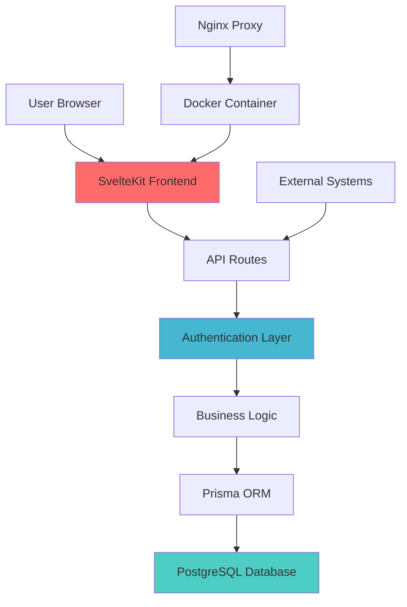

# Etikettdrucker Documentation

Welcome to the comprehensive documentation for the **Etikettdrucker** quality control and labeling system for Rotoclear manufacturing operations.

## Quick Navigation

| Section | Description | Link |
|---------|-------------|------|
| **Getting Started** | Quick setup and first steps | [Getting Started](Getting-Started) |
| **User Guide** | Complete user manual | [User Guide](User-Guide) |
| **API Reference** | Developer API documentation | [API Reference](API-Reference) |
| **Operations** | Production deployment guide | [Operations Guide](Operations-Guide) |
| **Security** | Security implementation details | [Security Guide](Security-Guide) |

## What is Etikettdrucker?

Etikettdrucker is a comprehensive **SvelteKit-based web application** designed for quality control and labeling operations in manufacturing environments. Built specifically for Rotoclear's production processes, it provides:

### Core Features
- **Multi-Product Support**: C2, CBASIC, CPRO product lines
- **Role-Based Access Control**: 6-tier permission system
- **Interactive Dashboards**: Real-time analytics and reporting
- **QR Code Generation**: Automated labeling with tracking
- **Database Management**: Multi-schema PostgreSQL architecture
- **Security**: JWT + session authentication with comprehensive audit logging

### Technology Stack
- **Frontend**: SvelteKit 2.x with TypeScript
- **Backend**: Node.js 20 with PostgreSQL 14+
- **Database**: Prisma ORM with multi-schema architecture
- **Deployment**: Docker containerization
- **Authentication**: JWT + Session hybrid system

## Quick Start

### For End Users
1. **[Getting Started Guide](Getting-Started)** - Setup and first login
2. **[User Guide](User-Guide)** - Complete feature walkthrough
3. **[FAQ](FAQ)** - Common questions and answers

### For Developers
1. **[Development Setup](Development-Setup)** - Local environment setup
2. **[API Reference](API-Reference)** - Complete API documentation
3. **[Architecture Overview](Architecture-Overview)** - System design and patterns
4. **[Contributing](Contributing)** - How to contribute to the project

### For Operations Teams
1. **[Operations Guide](Operations-Guide)** - Production deployment
2. **[Security Guide](Security-Guide)** - Security implementation
3. **[Troubleshooting](Troubleshooting)** - Common issues and solutions

## System Overview

## Current Status

**Version**: v1.0.0-beta  
**Status**: Production-ready beta  
**Last Updated**: September 2025  
**Documentation Coverage**: 95%+  

### Recent Updates
- Enhanced dashboard analytics with real-time metrics
- Improved security with comprehensive audit logging
- Multi-schema database optimization
- Docker deployment optimization
- Complete API documentation

## Documentation Sections

### User Documentation
- **[Getting Started](Getting-Started)** - New user onboarding
- **[User Guide](User-Guide)** - Complete feature documentation
- **[FAQ](FAQ)** - Frequently asked questions

### Developer Documentation
- **[Development Setup](Development-Setup)** - Environment setup
- **[API Reference](API-Reference)** - Complete API docs
- **[Architecture Overview](Architecture-Overview)** - System design
- **[Database Schema](Database-Schema)** - Database documentation
- **[Contributing](Contributing)** - Contribution guidelines

### Operations Documentation
- **[Operations Guide](Operations-Guide)** - Production deployment
- **[Security Guide](Security-Guide)** - Security implementation
- **[Troubleshooting](Troubleshooting)** - Issue resolution

### Reference Documentation
- **[Changelog](Changelog)** - Version history
- **[Code Style](Code-Style)** - Coding standards
- **[Testing Guide](Testing-Guide)** - Testing procedures

## Search Tips

Use the wiki search functionality to quickly find:
- **Functions**: Search for function names like `generateQRCode`
- **Features**: Search for feature names like "dashboard" or "authentication"
- **Errors**: Search for error messages or codes
- **Configuration**: Search for config keys or environment variables

## Getting Help

### Documentation Issues
- **Missing Information**: Create an issue in the main repository
- **Outdated Content**: Submit a pull request with updates
- **Unclear Instructions**: Open a discussion for clarification

### Technical Support
- **Bug Reports**: Use GitHub Issues with bug template
- **Feature Requests**: Use GitHub Discussions
- **Security Issues**: Contact the development team directly

### Contact Information
- **Development Team**: [Create Issue](https://github.com/JayeshKakkad-Rotoclear/Etikettdruck/issues)
- **Documentation**: [Documentation Issues](https://github.com/JayeshKakkad-Rotoclear/Etikettdruck/issues?q=label%3Adocumentation)
- **Emergency Support**: Contact your system administrator

## License & Legal

This documentation is part of the Etikettdrucker project and is subject to the same licensing terms. The system is designed for Rotoclear's internal operations and contains proprietary business logic.

---

**Last Updated**: September 4, 2025  
**Documentation Version**: 1.0.0-beta  
**Organization**: Rotoclear Manufacturing
